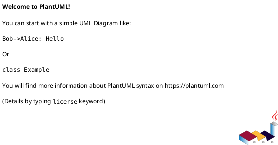

# Basic PlantUML Sequence Diagram Guide

## Quick Start

### View Online (Easiest)
1. Go to: http://www.plantuml.com/plantuml/uml/
2. Copy any diagram from `basic-sequence-diagram.puml`
3. Paste and see the result instantly!

### Alternative Viewers
- https://www.planttext.com/
- https://plantuml-editor.kkeisuke.com/

## Basic Syntax

### 1. Start and End


### 2. Define Participants
```plantuml
actor User
participant "System" as Sys
database Database
```

**Participant Types:**
- `actor` - Stick figure (for users)
- `participant` - Box (for systems/components)
- `database` - Database icon
- `boundary` - Boundary line
- `control` - Circle (for controllers)
- `entity` - Circle with line (for entities)

### 3. Basic Arrow (Message)
```plantuml
User -> System: Click button
System --> User: Show result
```

**Arrow Types:**
- `->` Solid line (synchronous call)
- `-->` Dashed line (response/return)
- `->>` Solid arrow
- `-->>` Dashed arrow

### 4. Add Title
```plantuml
title My Sequence Diagram
```

### 5. Add Notes
```plantuml
note left: This is a note
note right: Another note
note over User: Note over participant
```

### 6. Conditions (if/else)
```plantuml
alt Success
    API --> App: Return data
else Error
    API --> App: Return error
end
```

### 7. Loops
```plantuml
loop Every 5 minutes
    App -> Server: Check updates
    Server --> App: Send updates
end
```

### 8. Groups
```plantuml
group Login Process
    User -> App: Enter credentials
    App -> Server: Validate
end
```

## 15 Ready-to-Use Diagrams

### 1. Basic User Login
Simple login with email and password

### 2. Basic Registration
User registration flow

### 3. Basic CRUD Operations
Create, Read, Update, Delete operations

### 4. Basic API Call
API call with error handling

### 5. Basic Authentication Flow
Login with token management

### 6. Basic Form Submission
Form validation and submission

### 7. Basic Database Query
Database connection and query

### 8. Basic Shopping Cart
E-commerce cart flow

### 9. Basic File Upload
File upload with validation

### 10. Basic Search Function
Search with live results

### 11. Basic Notification System
Notification delivery system

### 12. Basic Payment Flow
Payment processing with approval/decline

### 13. Basic Cache System
Cache hit/miss logic

### 14. Basic Email Sending
Email sending with delivery status

### 15. Basic Session Management
Session create, validate, destroy

## Customization Examples

### Change Colors
```plantuml
participant "User" as U #lightblue
participant "System" as S #lightgreen
```

### Add Delays
```plantuml
User -> System: Request
...5 seconds later...
System --> User: Response
```

### Activate/Deactivate
```plantuml
User -> System: Request
activate System
System -> Database: Query
activate Database
Database --> System: Data
deactivate Database
System --> User: Response
deactivate System
```

### Autonumber Messages
```plantuml
autonumber
User -> System: First message
System -> Database: Second message
```

## Common Patterns

### Pattern 1: Request-Response
```plantuml
Client -> Server: Request
Server --> Client: Response
```

### Pattern 2: Three-Tier Architecture
```plantuml
User -> Frontend: Action
Frontend -> Backend: API Call
Backend -> Database: Query
Database --> Backend: Data
Backend --> Frontend: Response
Frontend --> User: Display
```

### Pattern 3: Error Handling
```plantuml
User -> App: Action
App -> API: Request

alt Success
    API --> App: 200 OK
    App --> User: Success
else Error
    API --> App: 500 Error
    App --> User: Error message
end
```

### Pattern 4: Async Operation
```plantuml
User -> App: Start process
App -> Worker: Queue job
App --> User: Job queued

Worker -> Database: Process
Worker --> User: Send notification
```

## Tips for Better Diagrams

### 1. Keep It Simple
- Focus on main flow
- Avoid too many participants
- Use clear names

### 2. Use Meaningful Names
```plantuml
' Good
actor "Customer" as Customer
participant "Payment Gateway" as Gateway

' Avoid
actor A
participant B
```

### 3. Add Comments
```plantuml
' This handles user authentication
User -> Auth: Login
```

### 4. Group Related Actions
```plantuml
group Validation
    App -> App: Check email format
    App -> App: Check password strength
end
```

### 5. Show Timing
```plantuml
User -> System: Request
...Processing...
System --> User: Response
```

## Quick Reference Card

```plantuml
@startuml Quick Reference

' Participants
actor User
participant System
database DB

' Title
title My Diagram

' Messages
User -> System: Solid arrow
System --> User: Dashed arrow

' Conditions
alt Condition A
    System -> DB: Action A
else Condition B
    System -> DB: Action B
end

' Loop
loop 3 times
    System -> DB: Query
end

' Note
note right: Important note

' Activation
activate System
System -> DB: Query
deactivate System

@enduml
```

## Common Mistakes to Avoid

### ❌ Wrong
```plantuml
User -> System
System -> Database
' Missing message labels
```

### ✅ Correct
```plantuml
User -> System: Click button
System -> Database: Save data
```

### ❌ Wrong
```plantuml
alt Success
    System -> User: OK
' Missing 'end'
```

### ✅ Correct
```plantuml
alt Success
    System -> User: OK
else Error
    System -> User: Error
end
```

## Export Options

### PNG Image
Most online editors have "PNG" button

### SVG (Scalable)
Better for documentation, click "SVG"

### ASCII Art
Some editors support text-based output

## Integration

### In Markdown (GitHub)
```markdown

```

### In Documentation
- Export as PNG/SVG
- Include in docs folder
- Reference in README

## Practice Exercise

Try creating this simple diagram:

**Scenario:** User books a movie ticket

**Steps:**
1. User selects movie
2. System shows available seats
3. User selects seat
4. System reserves seat
5. User makes payment
6. System confirms booking

**Solution:**
```plantuml
@startuml Movie Booking

actor User
participant "Booking System" as System
database "Database" as DB

User -> System: Select movie
System -> DB: Get available seats
DB --> System: Seat list
System --> User: Show seats

User -> System: Select seat
System -> DB: Reserve seat
DB --> System: Seat reserved

User -> System: Make payment
System -> System: Process payment

alt Payment Success
    System -> DB: Confirm booking
    DB --> System: Booking confirmed
    System --> User: Show ticket
else Payment Failed
    System -> DB: Release seat
    System --> User: Payment failed
end

@enduml
```

## Resources

- Official Documentation: https://plantuml.com/sequence-diagram
- Online Editor: http://www.plantuml.com/plantuml/uml/
- Cheat Sheet: https://ogom.github.io/draw_uml/plantuml/
- Examples: https://real-world-plantuml.com/

## Next Steps

1. Open `basic-sequence-diagram.puml`
2. Copy any diagram
3. Paste in online editor
4. Modify and experiment
5. Create your own diagrams!

Happy diagramming! 🎨
