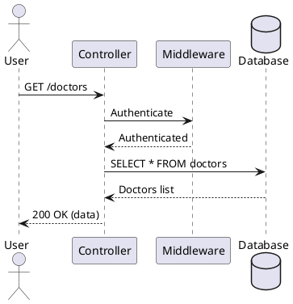
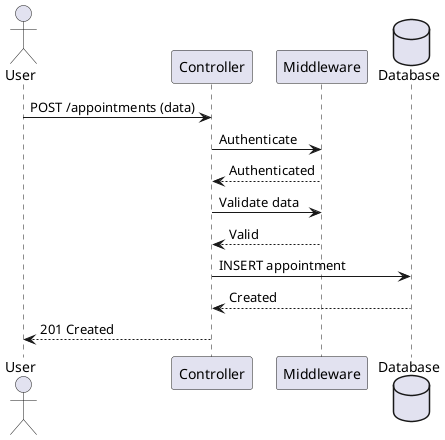
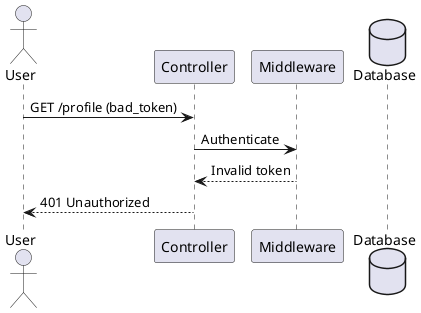

# Simple Sequence Diagrams Guide

## Overview
30 clean, simple sequence diagrams using only:
- **Actor** (User/Patient/Doctor)
- **Controller** (API endpoints)
- **Middleware** (Authentication, Validation, Business Logic)
- **Database** (Data storage)

## Quick View
Visit: **http://www.plantuml.com/plantuml/uml/**
Copy any diagram from `simple-sequence-diagrams.puml` and paste!

## Diagram Categories

### 🔐 Authentication (5 diagrams)
1. **User Registration** - Create new account
2. **User Login** - Login with credentials
3. **User Logout** - End session
4. **Password Reset Request** - Request password reset
5. **Password Reset Confirm** - Set new password

### 👤 User Profile (3 diagrams)
4. **Get User Profile** - View profile
5. **Update User Profile** - Edit profile
24. **Get Dashboard Stats** - View statistics

### 🩺 Symptom Checker (2 diagrams)
6. **Add Symptoms** - Submit symptoms for analysis
7. **Get Symptom History** - View past symptom checks

### 👨‍⚕️ Doctor Management (3 diagrams)
8. **Get All Doctors** - List all doctors
9. **Get Doctors by Specialization** - Filter doctors
25. **Search Doctors** - Search by name/specialization

### 📅 Patient Appointments (4 diagrams)
10. **Book Appointment** - Create new appointment
11. **Get Patient Appointments** - View appointments
12. **Cancel Appointment** - Delete appointment
24. **Get Dashboard Stats** - Appointment count

### 🏥 Doctor Portal (5 diagrams)
13. **Doctor Login** - Doctor authentication
14. **Doctor Get Appointments** - View doctor's appointments
15. **Doctor Confirm Appointment** - Approve appointment
16. **Doctor Reject Appointment** - Decline with reason
17. **Doctor Add Diagnosis** - Add diagnosis & prescription

### 💊 Medicine Reminders (4 diagrams)
18. **Add Medicine Reminder** - Create reminder
19. **Get All Medicines** - List medicines
20. **Mark Medicine as Taken** - Update status
21. **Delete Medicine** - Remove reminder

### ❌ Error Handling (5 diagrams)
26. **Invalid Token** - 401 Unauthorized
27. **Validation Failed** - 400 Bad Request
28. **Not Found** - 404 Not Found
29. **Unauthorized Access** - 403 Forbidden
30. **Server Error** - 500 Internal Server Error

## Architecture Pattern

All diagrams follow this simple pattern:

```
Actor → Controller → Middleware → Database
                                      ↓
Actor ← Controller ← Middleware ← Database
```

### Middleware Responsibilities
1. **Authentication** - Verify JWT tokens
2. **Validation** - Check input data
3. **Authorization** - Check permissions
4. **Business Logic** - Process data
5. **Error Handling** - Catch and format errors

## Common Flows

### 1. Protected Endpoint (with auth)
```
User → Controller: Request + token
Controller → Middleware: Authenticate
Middleware → Controller: Authenticated
Controller → Database: Query
Database → Controller: Data
Controller → User: Response
```

### 2. Public Endpoint (no auth)
```
User → Controller: Request
Controller → Middleware: Validate
Middleware → Controller: Valid
Controller → Database: Query
Database → Controller: Data
Controller → User: Response
```

### 3. Error Flow
```
User → Controller: Request
Controller → Middleware: Process
Middleware → Controller: Error
Controller → User: Error Response
```

## HTTP Status Codes Used

- **200 OK** - Success
- **201 Created** - Resource created
- **400 Bad Request** - Validation error
- **401 Unauthorized** - Invalid/missing token
- **403 Forbidden** - No permission
- **404 Not Found** - Resource not found
- **500 Internal Server Error** - Server error

## Middleware Functions

### Authentication Middleware
```javascript
// Verifies JWT token
authenticate(token) {
  - Decode token
  - Verify signature
  - Check expiration
  - Return user data
}
```

### Validation Middleware
```javascript
// Validates input data
validate(data, rules) {
  - Check required fields
  - Validate formats
  - Check constraints
  - Return errors or pass
}
```

### Authorization Middleware
```javascript
// Checks permissions
authorize(user, resource) {
  - Check ownership
  - Check role
  - Check permissions
  - Allow or deny
}
```

## Database Operations

### Common Queries
- **SELECT** - Read data
- **INSERT** - Create new record
- **UPDATE** - Modify existing record
- **DELETE** - Remove record
- **COUNT** - Count records

### Example Queries in Diagrams
```sql
-- User login
SELECT * FROM users WHERE email = ?

-- Book appointment
INSERT INTO appointments (user_id, doctor_id, date, time)

-- Update appointment
UPDATE appointments SET status = 'Confirmed' WHERE id = ?

-- Delete medicine
DELETE FROM medicines WHERE id = ? AND user_id = ?

-- Search doctors
SELECT * FROM doctors WHERE name LIKE ? OR specialization LIKE ?
```

## Token Flow

### Login → Token Generation
```
1. User sends credentials
2. Controller validates
3. Middleware verifies password
4. Middleware generates JWT
5. Controller returns token
```

### Using Token
```
1. User sends request + token
2. Controller extracts token
3. Middleware verifies token
4. Middleware extracts user_id
5. Controller uses user_id for query
```

## Quick Examples

### Example 1: Simple GET Request


### Example 2: POST with Validation


### Example 3: Error Handling


## Customization Tips

### Add More Details
```plantuml
Controller -> Middleware: Validate input
note right: Check email format,\npassword strength
```

### Show Timing
```plantuml
Controller -> Database: Complex query
...Processing 2 seconds...
Database --> Controller: Results
```

### Add Activation
```plantuml
activate Controller
Controller -> Database: Query
activate Database
Database --> Controller: Data
deactivate Database
deactivate Controller
```

### Group Operations
```plantuml
group Validation
    Controller -> Middleware: Check email
    Controller -> Middleware: Check password
end
```

## Testing Checklist

For each endpoint, verify:
- ✅ Authentication works
- ✅ Validation catches errors
- ✅ Database operations succeed
- ✅ Correct status codes returned
- ✅ Error handling works
- ✅ Authorization checks work

## API Endpoint Summary

### Patient Endpoints
```
POST   /register
POST   /login
POST   /logout
GET    /profile
PUT    /profile
POST   /symptoms
GET    /symptoms/history
GET    /doctors
GET    /doctors?spec=X
GET    /doctors/search?q=X
POST   /appointments
GET    /appointments
DELETE /appointments/:id
POST   /medicines
GET    /medicines
PUT    /medicines/:id/taken
DELETE /medicines/:id
GET    /dashboard/stats
POST   /password-reset
POST   /password-reset/confirm
```

### Doctor Endpoints
```
POST   /doctor/login
GET    /doctor/appointments
PUT    /doctor/appointments/:id/confirm
PUT    /doctor/appointments/:id/reject
PUT    /doctor/appointments/:id/diagnosis
```

## Database Schema Reference

### Tables Used
- `users` - Patient accounts
- `doctors` - Doctor profiles
- `appointments` - Appointment bookings
- `symptom_checks` - Symptom analysis records
- `medicines` - Medicine reminders
- `reset_tokens` - Password reset tokens

## Security Best Practices

1. **Always authenticate** protected endpoints
2. **Validate all input** before processing
3. **Check ownership** before modifications
4. **Hash passwords** before storing
5. **Use JWT tokens** for sessions
6. **Log errors** for debugging
7. **Sanitize queries** to prevent SQL injection

## Next Steps

1. Open `simple-sequence-diagrams.puml`
2. Choose a diagram (1-30)
3. Copy to online editor
4. View and understand the flow
5. Implement the API endpoint
6. Test with the flow in mind

## Resources

- View online: http://www.plantuml.com/plantuml/uml/
- Alternative: https://www.planttext.com/
- PlantUML docs: https://plantuml.com/sequence-diagram

---

**Total Diagrams:** 30
**Categories:** 8
**Participants:** 4 (Actor, Controller, Middleware, Database)

Simple, clean, and ready to implement! 🚀
